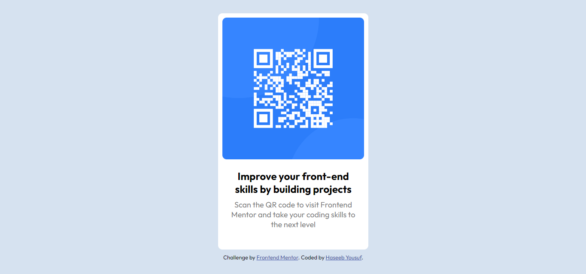

# Frontend Mentor - QR code component solution

This is a solution to the [QR code component challenge on Frontend Mentor](https://www.frontendmentor.io/challenges/qr-code-component-iux_sIO_H). Frontend Mentor challenges help you improve your coding skills by building realistic projects.

## Table of contents

- [Overview](#overview)
  - [Screenshot](#screenshot)
  - [Links](#links)
  - [Built with](#built-with)
  - [Author](#author)

## Overview

### Screenshot

### Links

- Solution URL: [Solution](https://github.com/haseebyousuf/frontend-playground/tree/main/Newsletter-Signup)
- Live Site URL: [Live](https://haseebyousuf.github.io/frontend-playground/Newsletter-Signup/)

### Built with

- Semantic HTML5 markup
- CSS
- Flexbox
- Mobile-first workflow

## Author

- Website - [Haseeb Yousuf](https://www.haseebyousuf.me)
- Frontend Mentor - [@haseebyousuf](https://www.frontendmentor.io/profile/haseebyousuf)
- Twitter - [@haseebyousuf](https://www.twitter.com/haseebyousuf)
